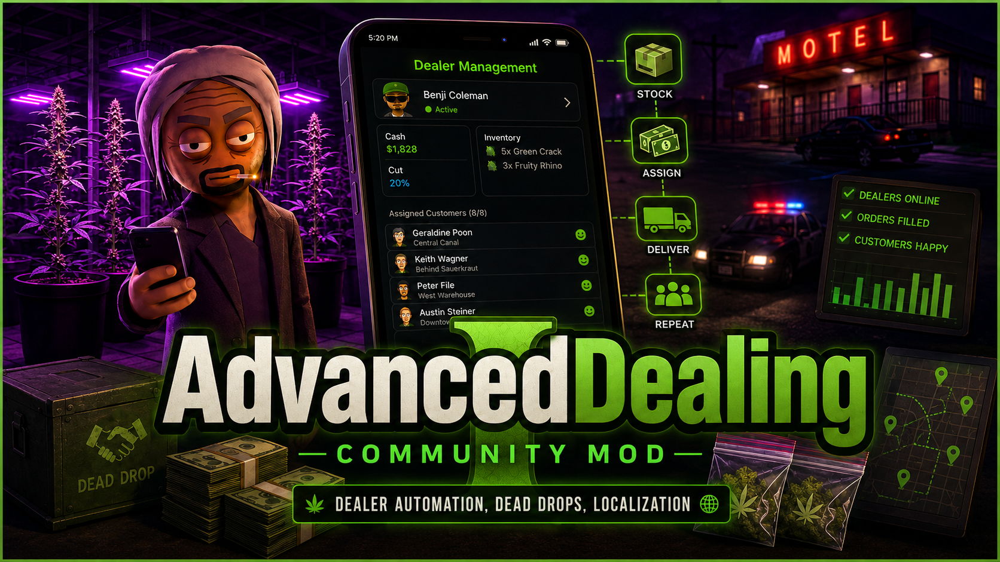

<p align="center">
  
</p>

<p align="center">
  <strong>English</strong> · <a href="./README_COMMUNITY_RU.md">Русский</a>
</p>

<p align="center">
  <a href="https://github.com/UrbanSide/AdvancedDealing/releases"></a>
  <a href="./LICENSE.txt"></a>
  
</p>

# AdvancedDealing Community

> Unofficial community-maintained fork of ManZune's AdvancedDealing.
>
> This branch adds Schedule I `0.4.5f2` compatibility, editable localization, separate product/cash dead drops, and legacy save migration. If no cash dead drop is selected, automatic delivery is disabled, cash stays on the dealer, and it is collected through the normal game interaction.

A MelonLoader mod for Schedule I that changes dealer behaviour, lets you communicate with dealers through the Messages app, automates product logistics and optional cash delivery, and provides editable localization files.

## Features

### Implemented

- Optional automatic cash delivery to a separately selected cash dead drop; without one, cash remains on the dealer for normal manual collection
- Communicate with dealers through the Messages app
- Product pickup at a separately selected product dead drop
- Allow more customers per dealer
- Add inventory slots to dealers
- Negotiate dealer cut percentage
- Access dealer inventories remotely
- Change dealer movement speed multiplier
- Fire dealers
- Compatible with Mod Manager
- Multiplayer ready
- IL2CPP and Mono source support
- Editable JSON localization with English fallback
- Legacy single-dead-drop save migration
- ~~Loyalty mode~~ — temporarily removed

### Planned

- Change dealer signing fee
- Customizable quality bonus
- More deal-related actions and behaviour for dealers and customers

<sub>Have an idea? Open an issue.</sub>

## Bugs and issues

Report community-fork bugs through this repository's [Issues](https://github.com/UrbanSide/AdvancedDealing/issues) section. For upstream history, see the original ManZune repository.

## Installation

### Manual installation

1. Install [MelonLoader](https://melonwiki.xyz) version `0.7` or newer.
2. Download the latest build from [Releases](https://github.com/UrbanSide/AdvancedDealing/releases).
3. Extract the archive and copy the appropriate DLL from its `Mods` folder into the game's `Mods` folder.
4. Launch the game.

#### Which DLL should I use?

- **IL2CPP** — default game branch: `AdvancedDealing.Il2Cpp.dll`
- **Mono** — alternate game branch: `AdvancedDealing.Mono.dll`

Do not install both DLLs at the same time.

## Configuration

The configuration file is generated after the first launch and is stored in the game's `UserData` folder. Save-specific settings are changed in game through the Messages app.

Editable localization files are stored in:

```text
UserData\AdvancedDealing\Localization\
```

## Multiplayer behaviour

The following settings cannot be changed while connected to a multiplayer session:

- `AccessInventory`
- `SettingsMenu`
- `NegotiationModifier`

## Credits

- Original mod: ManZune / Marcel Hellmund
- Separate product and cash dead-drop concept: Daniel Brenot (`daniel-brenot`), upstream PR #8
- Schedule I 0.4.5f2 compatibility, save migration, localization and community integration: UrbanSide / FPZone

Licensed under the [MIT License](./LICENSE.txt). Additional attribution is available in [NOTICE.md](./NOTICE.md).
